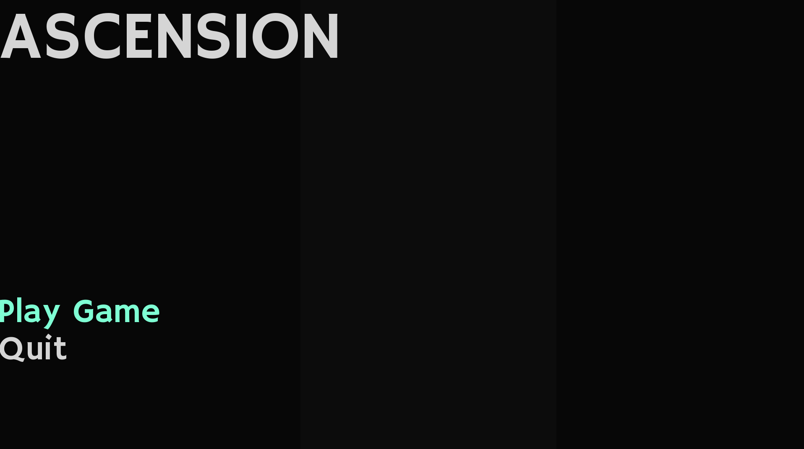
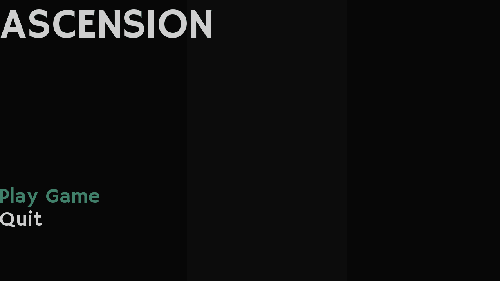

# Clockwork City: Gameplay Concept

A metroidvania platformer with Hollow Knight style gameplay.

*This entry was intended for Metroidvania Jam 2021, however I could not finish it!**
*However, there are some nice technical things that I started adopting more in other projects*
*most of the better ideas end up in [Legend-JRPG](https://github.com/Xpost2000/Legends-JRPG)*

## Feature List Summary

- Simple **Particle System** implementation with *interactive particles*
- Platformer collision detection with *slope support*
- *Backwards compatible* binary level formats
- Built-in game level editor
- Nail-bouncing, wall-jumpnig, and dashing as movement mechanics
- Controller and Keyboard support
- *Spatial partition* for the broadphase collision system
- Fixed timestep physics engine for deterministic behavior.
- Development console, (which is reused from [2D-Game-Framework](https://github.com/Xpost2000/2D-Game-Framework))

## Technical Description

In between classes, turns out it was extremely ambitious to think I
could create a metroidvania in a month.

While it is not complete, what is playable feels relatively polished
in terms of game feel. However there is no content for the game.

The graphics are rendered by SDL2's renderer API, and as a platformer
it uses basic AABB collision detection with slope support on tiles.

The particle system that was written for this project also supports
collision with the level tilemap to allow for nicer visual effects.

As the particle system supports at least a few thousand particles,
when trying to collide with the world this is inevitably extremely
expensive. So I utilized the grid structure of the tilemap in order to
implement a form of spatial partitioning. This allows the particle
system to participate in collision detection without demolishing the
performance of the game.

While the physics engine is workable enough for the timeframe I tried
to complete it in, there are quirks with the slope system and I was
only able to maintain correct behavior with a fixed timestep (likely
due to some of my slope bounds checks). This is useful in general
however, because it means the game will have generally deterministic
physics.

The game has a built-in level editor that is not very user friendly
and was created last minute.

## Media




## Development / Compiling
### Requirements / Dependencies
- SDL2, SDL2ttf, SDL2mixer, SDL2image : Platform layer library
- GLAD (included) : OpenGL extension wrangler
- A _Standard C Linux development environment_: On Windows you should use MinGW-w64 or MSYS2.

With these dependencies, you should be able to run make as such:
```
make all
```
